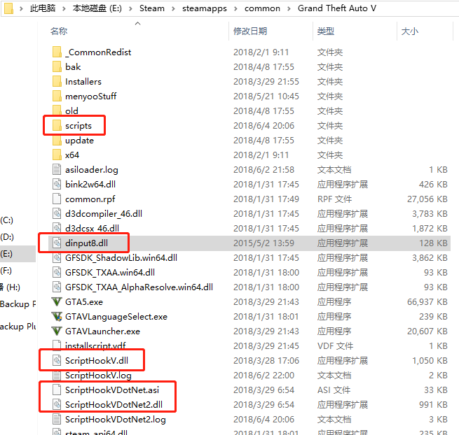

# GTA V 强化学习环境

## 条件

- 系统 Windows，因为 MAC 以及 linux 上没有 GTA V
- Grand Theft Auto V(侠盗猎车手 5) steam 或者原装均可
- visual studio (推荐 2017 版本)
- Alexander Blade 写的[C++ ScriptHook](http://www.dev-c.com/gtav/scripthookv/)
- [ScriptHookVDotNet](https://github.com/crosire/scripthookvdotnet/releases)

## [代码详解](GTAVRewardHook/readme.md)

## 使用本环境进行强化学习的例子

[在 GTAV 环境 中使用强化学习算法(Actor-Critic-LSTM)](https://github.com/zhaoying9105/Reinforcement-learning-in-GTAV)，我的另一个项目

## ScriptHook 和 ScriptHookVDotNet 的安装过程

`ScriptHook` 是 `GTA V` 的`C++ API`

`ScriptHookVDotNet` 是使用 `dotnet` 对 的封装

1.  `ScriptHook`

  
    

2.  `ScriptHookVDotNet`

  
    

3.  相应的文件放入 GTAV 主目录中，同时建立一个文件夹`scripts`，主文件应该如下图

  

## 使用与开发

1.  clone 本项目之后，使用 visual studio 打开

  

2.  修改属性

    点击 "项目" -> "GTARewardHook 属性"

    

      
    

    后期生成事件命令修改为

          `COPY "$(TargetPath)" "$(你的 GTAV 主目录)"`

3.  点击 "生成" -> "生成解决方案"

    会看到如下输出

  

    
  

4.  在 GTAV 游戏界面按"insert"键，脚本即被加载运行

    > 开发过程中不必关闭游戏，脚本更新后按"insert"键即可

1.  测试链接、获取数据

- 发送`GET`请求到`http://localhost:31730/test`,会得到"ok"字符串
- 发送`GET`请求到`http://localhost:31730/data`,会得到表示游戏数据的 Json 字符串

> 发送`GET`请求到`http://localhost:31730/data` 可能会得到错误信息，而不是 Json 字符串，这可能是因为此时 `MainTick` `函数正运行到某个位置，Detail` 类的属性不完整，故无法解析为 `Json` 字符串，此时继续发送请求即可。所以，建议使用 `Try-Catch` 语句捕获错误，如果出错就重发请求

## 开发的建议:

1.  如果希望在给定起点和终点的情况下进行驾驶策略的学习:
    请修改 `Detail` 中的 `StartPosition` 和 `EndPosition` 属性；
    另一种方案是点击地图，得到标记点(WayPoint)作为起点或者终点
2.  如果只是希望在 GTAV 中无目的驾驶的话应该做好出错工作:
    车辆会卡在某个位置，比如撞向车辆或者墙壁，绝不后退；或者落水，这时应该让车辆传送到附近的某个位置，并且随机设置车头的方向。
3.  不要随意更换车辆，尽量使用同一辆车
4.  尽量在正常区域行驶，不前往海边，山谷

## 如果是深度开发

1.  ScriptHookVDotNet 中的函数基本上都来自于 ScriptHook 建议参考 [ScriptHook SDK](http://www.dev-c.com/files/ScriptHookV_SDK_1.0.617.1a.zip) 中的 Native.h 或者 [nativedb](http://www.dev-c.com/nativedb/) 来查找合适的函数

2.  GTA V 开发的交流网站：[GTA forums 的 Coding 板块](https://gtaforums.com/forum/317-coding/)
3.  使用合适的方式 debug，建议使用 UI.Notify 将错误信息显示在游戏界面上
